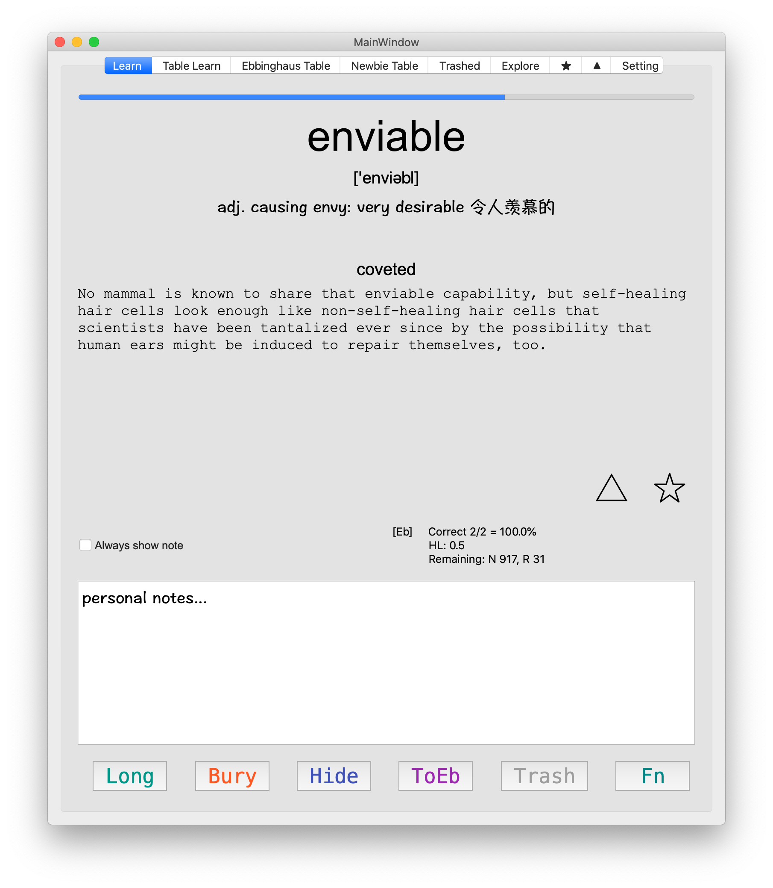
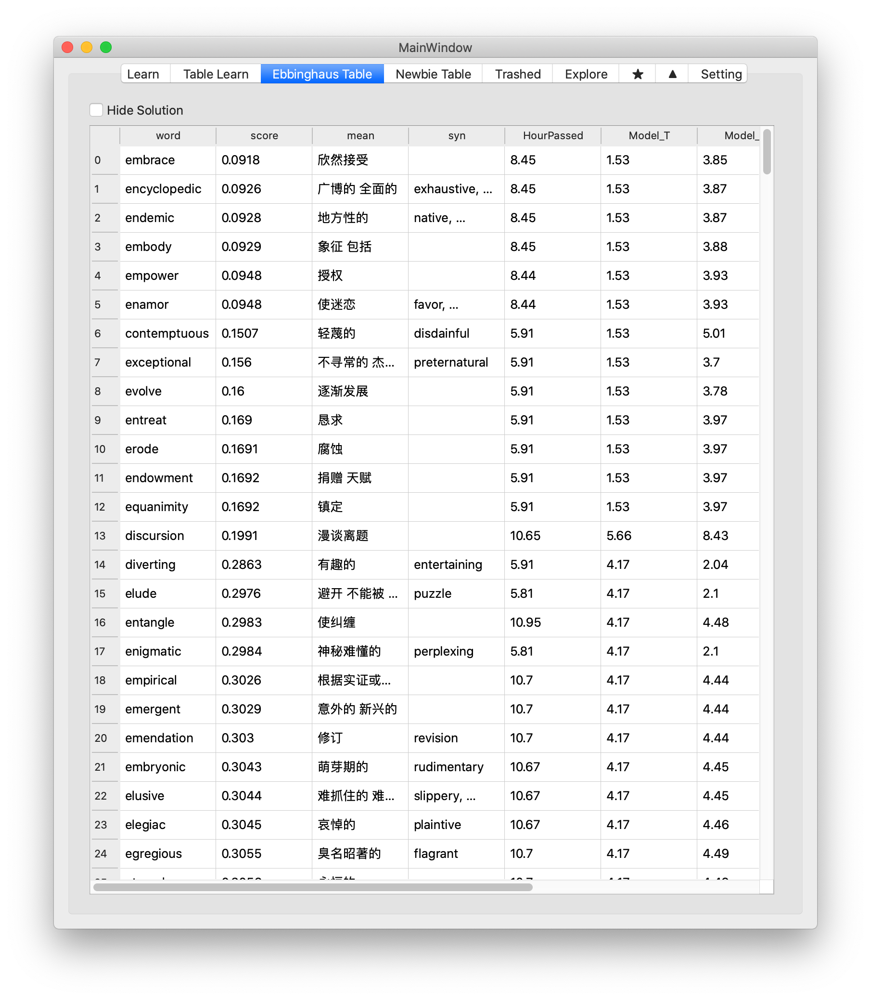

# Project FightMem
### Fight towards a permanent memory!
A smart, customized Ebbinghaus Quizzing / Flash Cards App built with PyQt5.

Learn Page                 |  Ebbinghaus Statistics Table  |  Settings Page
:-------------------------:|:-----------------------------:|:-------------------------:
  |     |

Frontend designed to work for memorizing words specifically but could be easily modified.

Backend powered by [Ebisu](https://github.com/fasiha/ebisu "Ebisu"). In the current version it contains two Ebisu lists:
- `Newbie List` New entres just learned with needs to be reviewed within minutes
- `Eb List` Learned entries to be reviewed in longer time periods

The two lists has differently turned Ebisu parameters to serve their purpose. Refer to [Ebisu Documentation](https://github.com/fasiha/ebisu#choice-of-initial-model-parameters "Ebisu Documentation") for the parameters. 

An entry will first get into `Newbie List` and being tested very frequently, until enough correct quiz results, during when it will be transferred into `Eb List` for longer quizzing intervals in order to achieve long time memory.

## Run
First make the knowledge file -- essentially a Pandas DataFrame. `util/pdf2knowledge.py` serves this purpose for the document that the developer uses. It's dependency is in `util/requirements.txt`


First install required packages,
```bash
pip install -r src/requirements/base.txt
```

If you want to use Google Sheet sync functionality, set up according to [df2gspread documentation](https://df2gspread.readthedocs.io/en/latest/overview.html#access-credentials)

To run the GUI,
```bash
fbs run
```

or,
```bash
cd src/main/python
python main.py
```


## Package
Create a python **3.6** virtual environment, and activate it. (As of Aug. 2020, Fman build system only support python 3.5 & 3.6)
```bash
pip install -r src/requirements/base.txt
fbs run # to make sure it works under virtual environment
fbs freeze # freeze the application
fbs installer # create installer
```
If things went successfully, the packaged application should apprear under `/target`

## Todo List
- [x] Function Key with left click Yes, right click No
- [x] User configurable parameters
- [x] Customized mark for entries to be displayed before solution
- [x] Auto backup database at startup
- [x] Trash can Page
- [x] Explore / Table Review Mode (especially adjacent knowledge)
- [x] Eb / Newbie / Star / Triangle only quiz-mode
- [x] TableView hide solution button
- [x] TableView fast review mode
- [x] Google sheet sync
- [x] Handle Ebisu assertion error (maybe reset the word?)
- [x] Different way to present multiple new knowledge entry (table?)
- [x] No more quiz today for a word (Bury)
- [x] Word count more details
- [x] HP Bar for fast recall training
- [x] Half the half-life (Hard -- mouse middle button on Fn)
- [x] Automatic TTS (Text-to-speech)
- [ ] Today wrong table
- [ ] ToNewbie table button (to start over)
- [ ] Undo last action
- [ ] Too much consecutive No should downgrade Eb to Newbie
- [ ] Search functionality for each table
- [ ] Support cloud backup db (maybe google drive?)
